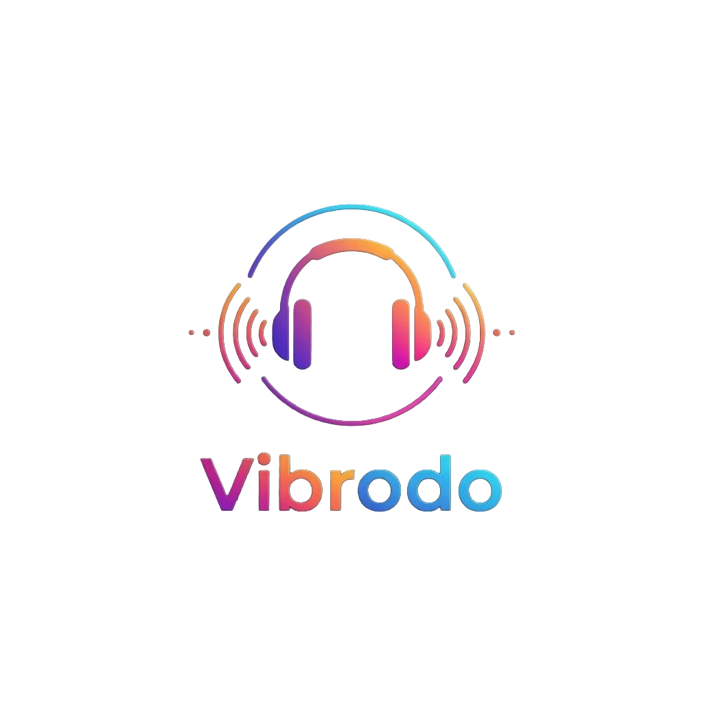

 

### VIBRODO

 

> *The infrastructure beneath the music. Built for millions. Engineered without compromise.*

 

 

---

 

<blockquote>
<strong>We are not building a music app.</strong> 
We are building the streaming infrastructure designed to serve millions of concurrent listeners with sub-200ms response times, zero-trust security by default, and an architecture that scales before it needs to.
</blockquote>

 

---

## ◈ &nbsp;01 &nbsp;— &nbsp;Engineering Values

 

Standards enforced at the architecture level, not aspirations on a slide.

<table>
<tr>
<td width="33%" valign="top">

**⚡ &nbsp;Latency**

`p99 < 200ms` across every critical path. If it's not measured, it's not shipped.

</td>
<td width="33%" valign="top">

**🔒 &nbsp;Zero-Trust**

No implicit network. No implicit identity. Every request is adversarial until verified.

</td>
<td width="33%" valign="top">

**🗄️ &nbsp;Index-First**

Every query ships with its execution plan. Unindexed production queries are design failures.

</td>
</tr>
</table>

 

---

## ◈ &nbsp;02 &nbsp;— &nbsp;Core Pillars

 

<table>
<tr>
<td width="33%" valign="top">

### 🔒 Zero-Trust
Security is the default state, not a configuration option. Secrets are write-only at runtime.

</td>
<td width="33%" valign="top">

### 📈 Scalability
Horizontal by design. Vibrodo scales with load, not around it.

</td>
<td width="33%" valign="top">

### ⚡ Performance
Sub-200ms p99 is the floor. We build for the worst case, not the demo case.

</td>
</tr>
</table>

 

---

## ◈ &nbsp;03 &nbsp;— &nbsp;Featured Repository

 

<table>
<tr>
<td width="20%" align="center"><strong>🎧</strong></td>
<td width="80%">

### [`vibrodo-backend`](https://github.com/vibrodo/vibrodo-backend)
The core streaming engine — auth pipeline, data layer, and API surface serving the platform.

`Node.js` · `Express` · `MongoDB` · `JWT` · `Redis (incoming)`

</td>
</tr>
</table>

 

<strong>&nbsp;▶ &nbsp;Other Repositories &nbsp;—&nbsp; Click to expand</strong>

 

| Repository | Description |
|---|---|
| `vibrodo-sdk` | Client libraries for stream integration |
| `vibrodo-cli` | Command-line tooling for local dev and ops |
| `vibrodo-docs` | Architecture references and API specs |

 

---

## ◈ &nbsp;04 &nbsp;— &nbsp;Connect

 

 

---

## ◈ &nbsp;05 &nbsp;— &nbsp;Internal Engineering & Strategy

 

Vibrodo operates as a proprietary infrastructure ecosystem. Source code access is strictly restricted to core maintainers and authorized engineers.

**Core Execution Tracks (Q3/Q4 2026):**
*   **Closed Beta Gatekeeping:** Establishing high-throughput proxy structures for external sandbox streaming.
*   **Mentorship & Collaboration:** For enterprise evaluation (GSoC/LFX mapping), microservice architectures are demonstrated via high-fidelity architecture specs and sandboxed mock APIs rather than public source execution.

<strong>&nbsp;▶ &nbsp;Enterprise Engineering Access &nbsp;—&nbsp; Click to expand</strong>

 

- Contributions are strictly restricted to vetted internal branch pipelines.
- Direct external PR requests are auto-blocked by default organizational IAM policies.
- Architectural evaluation can be scheduled via secure preview channels.

---

 

  Two people building infrastructure designed for millions. Every line of code in this organization is a long-term commitment.

  <code>VIBRODO ENGINEERING // SYSTEM STATUS: CLOSED-BETA</code>

  &copy; 2026 Vibrodo, Inc. All rights reserved. V-1.0.0-PROPRIETARY

